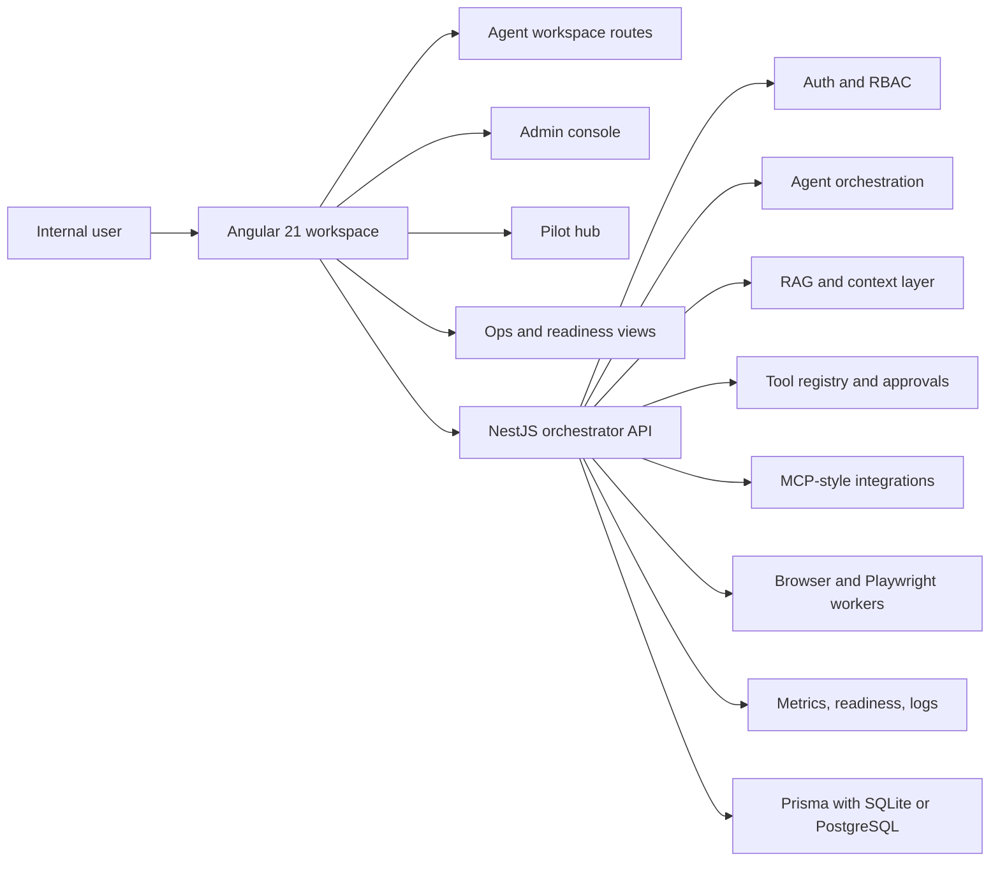
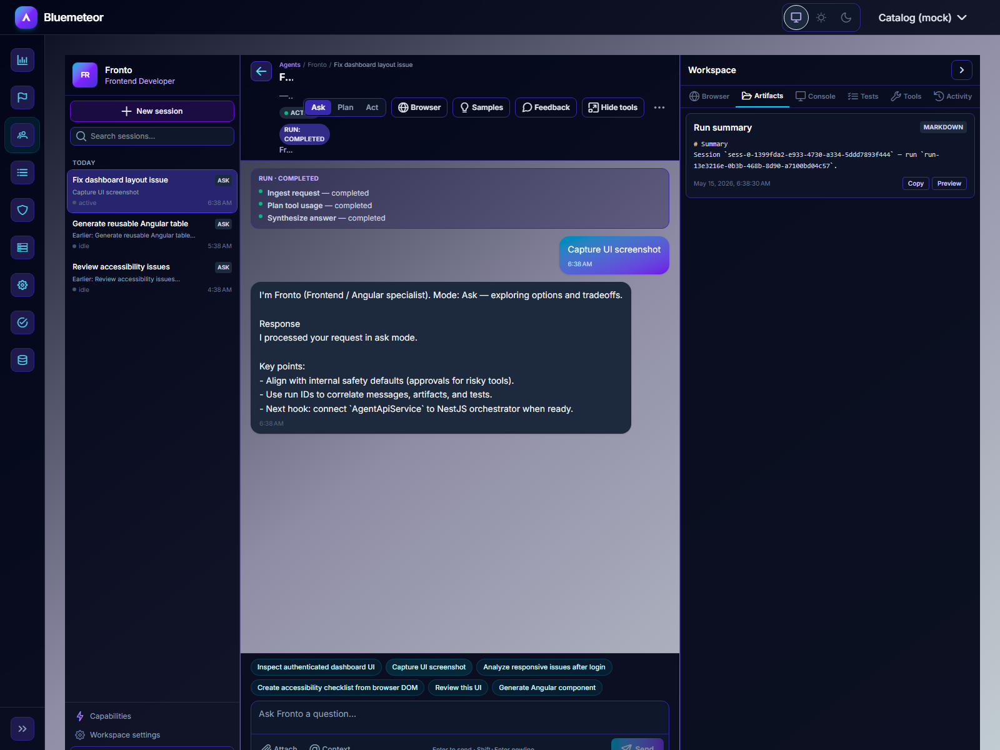
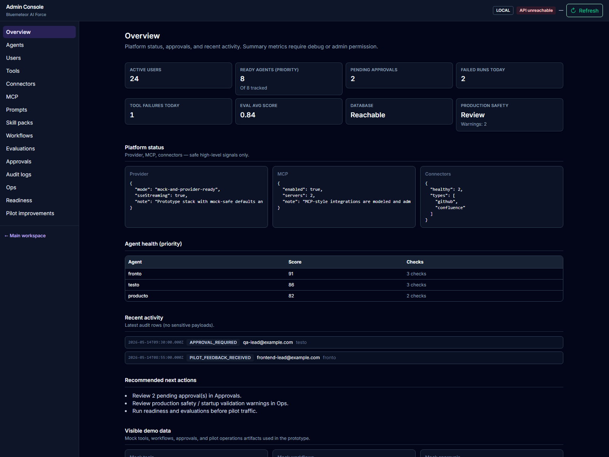
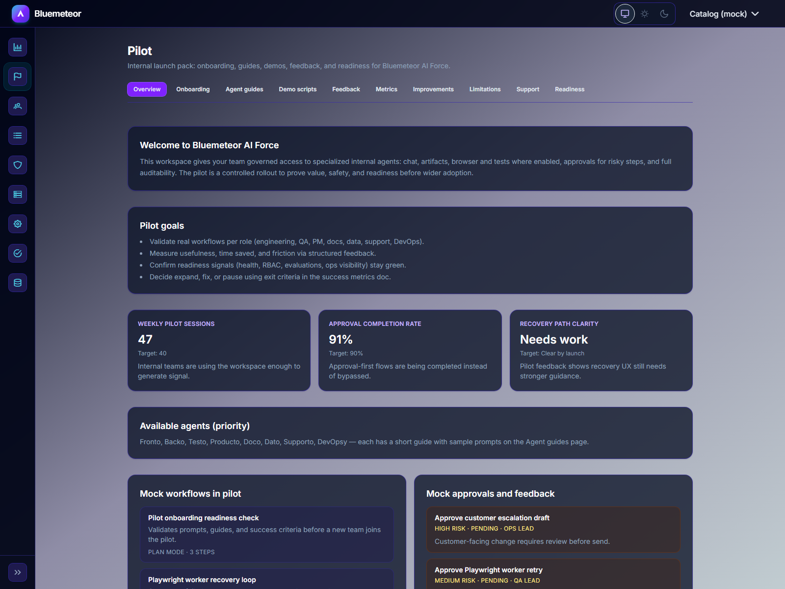
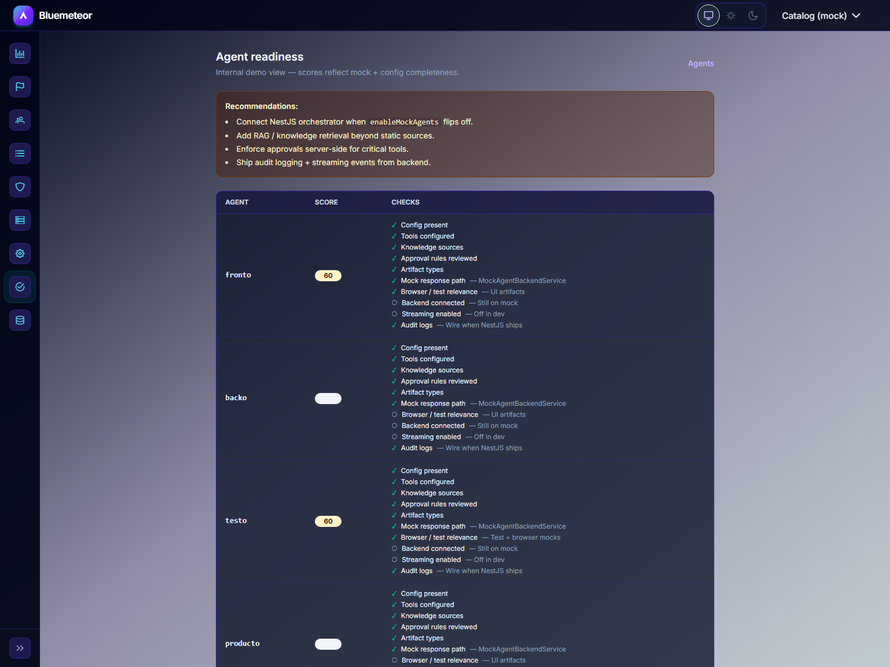
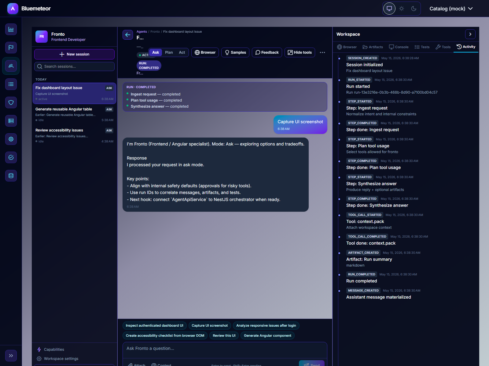

# Org AI Force

Enterprise Angular 21 agent workspace prototype with a NestJS orchestrator, admin-governed tools, RAG-ready services, MCP-style integrations, SSE streaming hooks, Playwright/browser workers, and internal pilot operations.

This repo is a **prototype and architecture proof project**, not a claim of production enterprise adoption. It is designed to show how an internal AI agent workspace could be structured across frontend, backend, admin governance, and pilot rollout concerns.

## What Is Implemented Vs Mock Vs Planned

### Implemented

- Angular 21 workspace shell with routes for agents, admin, pilot, ops, logs, readiness, and debug tools
- NestJS server modules for auth, agents, tools, RAG, connectors, pilot ops, observability, and browser workers
- role and permission guards for the frontend and backend
- Docker and Docker Compose setup for a local or pilot-style environment
- Prisma schemas for SQLite and PostgreSQL-oriented deployment paths
- mock-safe workspace behavior for agent sessions, artifacts, tool events, approvals, and test-worker style flows

### Mock Or Demo-Safe

- many agent responses and runtime events in frontend demo mode
- demo tools, demo workflows, demo approvals, and pilot feedback seed data
- browser and Playwright worker experience when used as a safe prototype path
- some admin and pilot dashboard content when running without a fully wired backend stack

### Planned Or Still Maturing

- deeper production-grade provider integration and hardening
- fuller RAG citation and retrieval UX
- richer evaluation dashboards and agent scorecards
- multi-tenant controls and broader connector coverage
- stronger production observability and automated validation coverage

## Architecture



## Local Docker Quick Start

1. Copy the environment template:

```bash
cp .env.docker.example .env
```

2. Set required values in `.env`, especially secrets such as `POSTGRES_PASSWORD`, JWT values, and provider keys when needed.

3. Start the stack:

```bash
docker compose up --build
```

4. Open the frontend:

```text
http://localhost:8080
```

Use local development instead if you want to run frontend and backend separately.

## Local Development

Frontend:

```bash
npm install
npm start
```

Backend:

```bash
cd server
npm install
npm run build
npm run start:dev
```

## Demo Routes

- `/login`
- `/dashboard`
- `/agents`
- `/agents/:slug`
- `/admin`
- `/pilot`
- `/pilot/metrics`
- `/pilot/readiness`
- `/agent-readiness`
- `/ops`
- `/mcp-debug`
- `/internal-tools-debug`
- `/browser-test-debug`

## Demo Surfaces

- agent workspace with chat, artifacts, approvals, tool window, and runtime events
- admin overview with visible mock tools, workflows, approvals, and platform summary
- pilot hub with rollout guidance, feedback loops, and readiness framing
- readiness report showing priority-agent status

## Screenshots

Available assets:

- `docs/assets/screenshots/workspace.png`
- `docs/assets/screenshots/admin-dashboard.png`
- `docs/assets/screenshots/pilot-hub.png`
- `docs/assets/screenshots/readiness-report.png`
- `docs/assets/screenshots/tool-execution-timeline.png`
- `docs/assets/screenshots/org-ai-force-demo.gif`

<p align="center">
  
</p>

<p align="center">
  
</p>

<p align="center">
  
</p>

<p align="center">
  
</p>

<p align="center">
  
</p>

Capture guidance:
- [docs/screenshot-capture-guide.md](docs/screenshot-capture-guide.md)

## Security Model

- no secrets should be committed to the repo
- admin and debug routes are permission-gated
- tool execution and approvals are treated as governed flows
- mock mode exists for safe demoing when live systems are unavailable
- Docker and environment templates are examples, not a substitute for real vaulting, HTTPS, or production secret handling

Start with:
- [docs/security-model.md](docs/security-model.md)

## Documentation

- [System architecture](docs/system-architecture.md)
- [Agent orchestration](docs/agent-orchestration.md)
- [RAG and tool layer](docs/rag-and-tool-layer.md)
- [Admin console](docs/admin-console.md)
- [Pilot rollout](docs/pilot-rollout.md)
- [Security model](docs/security-model.md)
- [Observability](docs/observability.md)
- [Recruiter review guide](docs/recruiter-review-guide.md)

## Recruiter Review

For the fastest walkthrough, use:
- [docs/recruiter-review-guide.md](docs/recruiter-review-guide.md)

## Validation Commands

Frontend:

```bash
npm run build
npm run typecheck
```

Backend:

```bash
cd server
npm run build
npm run typecheck
```

Docker:

```bash
docker compose config
```
