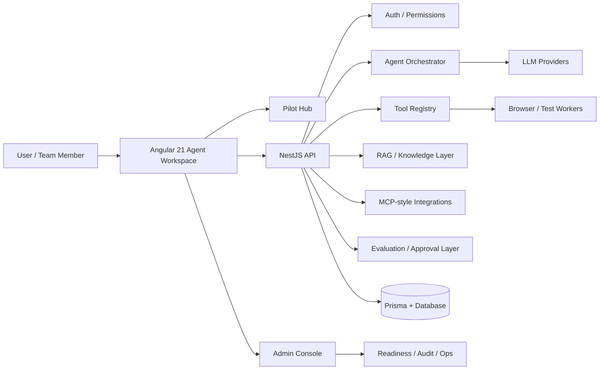

# Org AI Force

**Enterprise Angular AI Agent Workspace with NestJS Orchestration, RAG, MCP Tools, SSE Streaming, Admin Console, and Internal Pilot Workflows.**

Org AI Force is an internal AI workforce platform built to help enterprise teams interact with role-based AI agents inside a modern Angular workspace. It combines an **Angular 21 frontend**, **NestJS backend**, **agent orchestration**, **RAG**, **tool execution**, **MCP-style integrations**, **browser/test workers**, and an **admin console** for operating agents, tools, prompts, workflows, approvals, and pilot readiness.

---

## Why This Project Exists

Enterprise teams need AI assistants that do more than answer questions.

This project explores how AI agents can work inside real business applications by combining:

- Context-aware copilot interfaces
- Role-based AI agents
- Retrieval-augmented generation
- Tool execution workflows
- Streaming AI responses
- Admin-governed approvals
- Browser/test automation workers
- Internal pilot operations
- Observability and readiness checks

The goal is to move from a simple chatbot to a practical **AI employee workspace** for enterprise operations.

---

## Key Capabilities

### Agent Workspace

- Angular-based multi-agent workspace
- Role-based agent discovery and activation
- Session-based agent conversations
- Real-time streaming response UX
- Tool call visibility and execution state tracking
- Internal pilot experience for authenticated users

### AI Orchestration

- NestJS orchestrator for agent workflows
- RAG-ready backend architecture
- Tool registry and connector-ready design
- MCP-style tool integration direction
- Prompt, workflow, approval, and evaluation management
- Support for LLM provider integration through backend services

### Admin Console

Available at:

```text
/admin
````

The admin console helps leads and admins operate the platform:

* Overview dashboard
* Agent management
* User management
* Tool registry
* Connectors
* MCP configuration
* Prompt management
* Skill packs
* Workflows
* Evaluations
* Approvals
* Audit views
* Ops/readiness checks

The console is permission-gated and avoids exposing raw secrets or credentials.

### Internal Pilot Hub

Available at:

```text
/pilot
```

The pilot hub provides a controlled rollout experience for authenticated users:

* Pilot overview
* Onboarding guidance
* Agent usage guides
* Demo scripts
* Known limitations
* Feedback collection
* Support and escalation templates

Additional pilot routes:

```text
/pilot/metrics
/pilot/readiness
```

---

## Tech Stack

### Frontend

* Angular 21
* TypeScript
* RxJS
* Angular Router
* PrimeNG / UI components
* Tailwind CSS
* Modular workspace architecture
* Agent workspace UI
* Admin and pilot dashboards

### Backend

* NestJS
* Node.js
* Prisma
* REST APIs
* Server-Sent Events
* Authentication / authorization
* Tool execution services
* RAG-ready service layer
* Evaluation and approval flows

### AI / Agent Layer

* LLM integration-ready architecture
* RAG workflow direction
* MCP-style tool integration
* Agent orchestration
* Tool registry
* Prompt management
* Skill packs
* Workflow execution
* Browser/test workers

### Infrastructure

* Docker
* Docker Compose
* PostgreSQL for pilot deployment
* SQLite for local development
* nginx reverse proxy
* CI/CD-ready structure
* Observability documentation

---

## Architecture Overview



## Project Structure

```text
.
├── src/                      # Angular frontend application
├── server/                   # NestJS backend API and orchestrator
├── docs/                     # Deployment, pilot, admin, ops, and architecture docs
├── docker-compose.yml        # Docker pilot setup
├── nginx/                    # nginx reverse proxy configuration
├── prisma/                   # Database schema and migrations, if configured at root
├── .env.docker.example       # Docker environment template
└── README.md
```

---

## Getting Started

### Option 1: Docker Pilot Setup

Use this when you want the full pilot-style environment with PostgreSQL and nginx.

```bash
cp .env.docker.example .env
docker compose up --build
```

Then open:

```text
http://localhost:8080
```

The API is proxied at:

```text
/api
```

Useful docs:

* [Deployment Guide](docs/deployment-guide.md)
* [Database Operations](docs/database-operations.md)
* [Observability](docs/observability.md)

---

### Option 2: Local Development

Run the Angular frontend:

```bash
npm install
ng serve
```

Open:

```text
http://localhost:4200
```

Run the backend:

```bash
cd server
npm install
npm run start:dev
```

Default local database:

```text
SQLite: file:./dev.db
```

---

## Common Commands

### Frontend

```bash
ng serve
ng build
ng test
ng e2e
```

### Backend

```bash
cd server
npm run start:dev
npm run build
npm run test
```

### Docker

```bash
docker compose up --build
docker compose down
```

---

## Environment Setup

Create a local `.env` file from the example file:

```bash
cp .env.docker.example .env
```

Typical environment areas:

```text
DATABASE_URL=
JWT_SECRET=
OPENAI_API_KEY=
ANTHROPIC_API_KEY=
MCP_SERVER_URL=
APP_BASE_URL=
API_BASE_URL=
```

Do not commit real secrets.

---

## Important Routes

### Application Routes

```text
/                  Main application workspace
/admin             Admin console
/pilot             Internal pilot hub
/pilot/metrics     Pilot metrics
/pilot/readiness   Pilot readiness gate and report
```

### Pilot API

```text
POST /pilot/feedback
GET  /pilot/feedback
```

`POST /pilot/feedback` is available to authenticated users.

`GET /pilot/feedback` is restricted to admin/debug roles.

---

## Documentation

### Admin and Operations

* [Admin Console Guide](docs/admin-console-guide.md)
* [Internal Pilot Readiness](docs/internal-pilot-readiness.md)
* [Observability](docs/observability.md)

### Pilot Rollout

* [Internal Pilot Launch Plan](docs/internal-pilot-launch-plan.md)
* [Pilot User Guide](docs/pilot-user-guide.md)
* [Pilot Admin Guide](docs/pilot-admin-guide.md)
* [Pilot Demo Script](docs/pilot-demo-script.md)
* [Pilot Sample Prompts](docs/pilot-sample-prompts.md)
* [Pilot Success Metrics](docs/pilot-success-metrics.md)

### Deployment and Database

* [Deployment Guide](docs/deployment-guide.md)
* [Database Operations](docs/database-operations.md)

---

## Security and Governance

This project is designed with enterprise AI governance in mind:

* Authenticated access for pilot users
* Permission-gated admin console
* Restricted metrics and readiness routes
* No raw credential display in the UI
* Approval-oriented workflow direction
* Audit and ops views for admin users
* Environment-based secret management

Recommended production hardening:

* Use strong JWT secrets
* Store secrets in a secure vault
* Enforce HTTPS
* Add rate limiting
* Add request validation
* Add tenant-aware access controls
* Add audit logs for sensitive tool execution
* Use least-privilege permissions for tools and connectors
---

## Roadmap

### Current Focus

* Internal pilot workspace
* Admin console
* Agent management
* Tool registry
* Prompt and workflow management
* Feedback collection
* Pilot readiness reporting

### Next Improvements

* Add polished public demo screenshots
* Add live walkthrough video
* Improve agent session replay
* Add richer RAG source citation UI
* Add MCP tool execution examples
* Add Playwright-based browser worker demos
* Add evaluation dashboards
* Add multi-tenant governance layer
* Add CI/CD deployment examples
* Add test coverage reports

---
